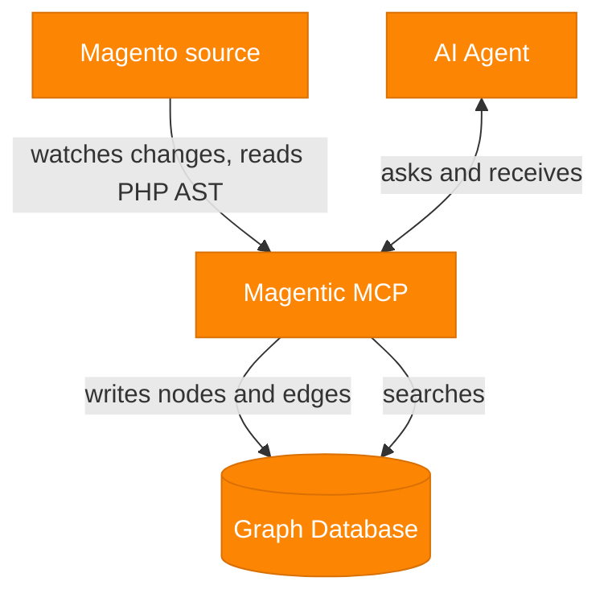

<p align="center">
  
</p>

<h1 align="center">Magentic - Magento MCP Server</h1>

<p align="center">
Magentic is a self-hosted <strong>standard MCP (Model Context Protocol) server</strong>.<br/>
Magentic maps the Magento codebase into a graph that any <strong>AI agent can explore for grounded symbolic reasoning</strong>.
</p>

## How it works

Magentic uses **symbolic reasoning to prevent the model from hallucinating**.
There are four participants in the algorithm: the AI Agent, the Magentic MCP, the Magentic Graph Database, and the Magento source. It works with any standard AI agent solution that implements MCP, such as *Anthropic Claude, OpenAI Codex, Google Antigravity*, and others.

- Magentic watches your source for file changes and runs a partial update or a full reindex.
- It understands the PHP abstract syntax tree and pushes it into the graph database.
- Your AI agent talks to the Magentic MCP, and Magentic searches the graph for it.



## Setup

### 1. Prerequisites

- **MacOS**: [OrbStack](https://orbstack.dev/) (recommended) or [Docker Desktop](https://www.docker.com/products/docker-desktop/)
- **Windows**: [Docker Desktop](https://www.docker.com/products/docker-desktop/) or Docker Engine installed in WSL2 with the Compose plugin
- **Linux**: [Docker Desktop](https://www.docker.com/products/docker-desktop/) or Docker Engine with the Compose plugin

### 2. Download

Clone it with git:

```bash
cd to-your-project-directory
git clone https://github.com/DavidBelicza/Magento-MCP-Server.git .
```

Or download it as a zip from the [releases page](https://github.com/DavidBelicza/Magento-MCP-Server/releases), unzip it, and open the folder in a terminal.

### 3. Install

Copy the content of `.env.example` into a new `.env` file:

```bash
cp .env.example .env
```

Open the `.env` file and set `MAGENTIC_ANALYZED_SOURCE_HOST_PATH` to the absolute path of the codebase you want to analyze.

If port `8081` is already in use on your machine, change `FRONTEND_HTTP_PORT`.

The first run builds everything and can take a few minutes (this command needs to be executed later too if you change the `.env` file):

```bash
docker compose up -d
```

### 4. Configure

The graph is empty until you index your source.

1. Open `http://localhost:8081`.
2. Go to **Settings**.
3. Under **Indexing Pipeline**, click **Reset & reindex**.

Indexing time depends on your machine and the size of the codebase. It can take from about a minute on a capable machine to around half an hour on a slow one. You can keep using the app while it runs, and the status updates when it finishes.

### 5. Connect your AI agent

The MCP endpoint is `http://localhost:8081/mcp` (replace `8081` if you changed the port). The examples use the default token `example-token`. If you set your own `MAGENTIC_API_TOKEN`, use that value instead.

#### Anthropic Claude Code

From your Magento project folder, run:

```bash
claude mcp add --scope project --transport http magentic http://localhost:8081/mcp \
  --header "Authorization: Bearer example-token"
```

This creates a `.mcp.json` in your Magento project. Run `/mcp` to confirm it is connected.

*Alternatively, you can ask your AI agent to set it up for you, then restart the AI agent.*

#### OpenAI Codex

Create `.codex/config.toml` in your Magento project:

```toml
[mcp_servers.magentic]
url = "http://localhost:8081/mcp"
bearer_token_env_var = "MAGENTIC_API_TOKEN"
```

Codex reads the token from an environment variable. Set it, then restart Codex:

```bash
export MAGENTIC_API_TOKEN=example-token
```

*Alternatively, you can ask your AI agent to set it up for you, then restart the AI agent.*

#### Google Antigravity

Open **Settings → MCP Config** and add:

```json
{
  "mcpServers": {
    "magentic": {
      "serverUrl": "http://localhost:8081/mcp",
      "headers": {
        "Authorization": "Bearer example-token"
      }
    }
  }
}
```

*Alternatively, you can ask your AI agent to set it up for you, then restart the AI agent.*

### Troubleshooting

#### Update Magentic

After pulling a new version, rebuild and recreate the containers from the project folder:

```bash
git pull
docker compose up -d --build
```

This refreshes the images and restarts the stack with the new code. Your indexed graph and other data remain untouched.

#### Remove Magentic

Run this **from the project folder** to stop everything and delete the containers, the graph data, and the images:

```bash
docker compose down -v --rmi all
```

## Documentation

- [`docs/architecture_project.md`](docs/architecture_project.md) covers the overall project and service architecture.
- [`docs/architecture_world_mapping.md`](docs/architecture_world_mapping.md) covers how source is indexed into the graph.
- [`docs/architecture_mcp.md`](docs/architecture_mcp.md) covers the MCP service and its tools.
- [`docs/architecture_auth.md`](docs/architecture_auth.md) covers the access-control design.
- [`docs/test_system_sanity.md`](docs/test_system_sanity.md) covers runtime and integration checks.
- [`docs/README-performance.md`](docs/README-performance.md) covers analyzer performance notes.
- [`AGENTS.md`](AGENTS.md) is the contributor and development guide.
