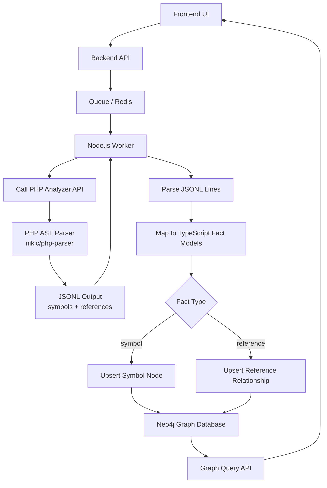
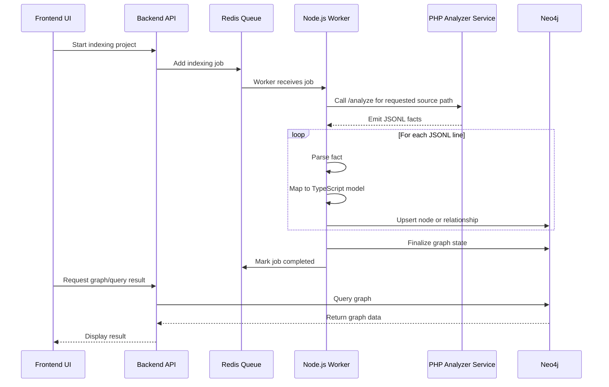
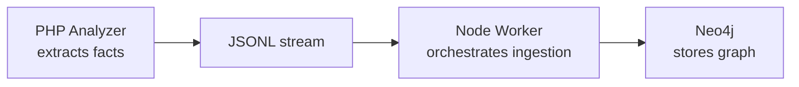

# World Mapping Architecture

Magentic uses source-code indexing to build a graph-backed world model for AI grounding. The PHP analyzer extracts facts from source files, and the Node.js worker turns those facts into graph nodes and relationships in Neo4j.

The current PHP analyzer phase maps PHP class declarations and `extends` references. Later phases can add interfaces, traits, method calls, dependency injection relationships, package ownership, XML configuration, and other Magento-specific facts.



## Responsibility Split

```mermaid
flowchart LR
    subgraph PHP_Analyzer_Service[PHP Analyzer Service]
        A1[Resolve requested paths]
        A2[Stream PHP files]
        A3[Parse AST]
        A4[Extract symbols]
        A5[Extract references]
        A6[Emit JSONL]
    end

    subgraph Node_Worker[Node.js Worker]
        B1[Start indexing job]
        B2[Run PHP command]
        B3[Read JSONL stream]
        B4[Validate facts]
        B5[Convert to TypeScript models]
        B6[Write to Neo4j]
        B7[Update job status]
    end

    subgraph Neo4j[Neo4j]
        C1[Symbol:PHP:Class nodes]
        C2[Package nodes]
        C3[EXTENDS relationships (with identity hash)]
        C4[BELONGS_TO_PACKAGE relationships]
    end

    PHP_Analyzer_Service --> Node_Worker
    Node_Worker --> Neo4j
```

## Runtime Flow



## Fact Flow

```mermaid
flowchart TD
    A[PHP file] --> B[AST]
    B --> C[Extracted Facts]

    C --> D[Symbol Fact]
    C --> E[Reference Fact]
    C --> I[Error Fact]

    D --> F[Symbol Node (e.g. :Symbol:PHP:Class)]
    E --> G[Graph Relationship]
    I --> J[Indexing diagnostics]

    F --> H[Neo4j]
    G --> H
```

## PHP Analyzer Service

The analyzer reads paths relative to `MAGENTIC_ANALYZED_SOURCE_PATH`. In Docker, the default container path is `/mnt/analyzed-source`.

```bash
docker run --rm --network magentic_default curlimages/curl -s -X POST http://magentic_analyzer_php/analyze -H "Content-Type: application/json" -d '{"path": "vendor/magento/module-catalog"}'
```

The endpoint returns JSONL. It does not write graph data directly and does not emit human-readable status lines on stdout.

## Example JSONL Output

```jsonl
{"fact":"symbol","symbolId":"php-class:Vendor\\Module\\A","fqcn":"Vendor\\Module\\A","kind":"class"}
{"fact":"symbol","symbolId":"php-class:Vendor\\Module\\B","fqcn":"Vendor\\Module\\B","kind":"class"}
{"fact":"reference","kind":"extends","fromSymbolId":"php-class:Vendor\\Module\\A","toSymbolId":"php-class:Vendor\\Module\\B"}
{"fact":"error","path":"relative/path/bad.php","message":"Syntax error, unexpected EOF on line 1"}
```

Current facts:

- `symbol`: declares or references a PHP class symbol by stable `symbolId`. Mapped into Neo4j using multi-label taxonomy (e.g., `:Symbol:PHP:Class`, `:Symbol:PHP:Interface`).
- `reference`: records a relationship between symbols, currently only `kind: "extends"`. Translated into an `EXTENDS` relation in Neo4j. Relationships contain an `identity` hash (e.g., `md5(fromSymbolId + "EXTENDS" + toSymbolId)`) to prevent duplicate edges.
- `error`: records parser or read failures for one file while allowing the stream to continue.

Duplicate symbol facts are allowed. The graph ingestion layer should `MERGE` nodes by `symbolId`.

## Main Principle



The PHP Analyzer should stay simple: it reads source code and emits facts.

The Node.js worker owns the workflow: job execution, status, JSONL parsing, TypeScript mapping, and Neo4j writes.

Neo4j stores the final graph: nodes and relationships.
