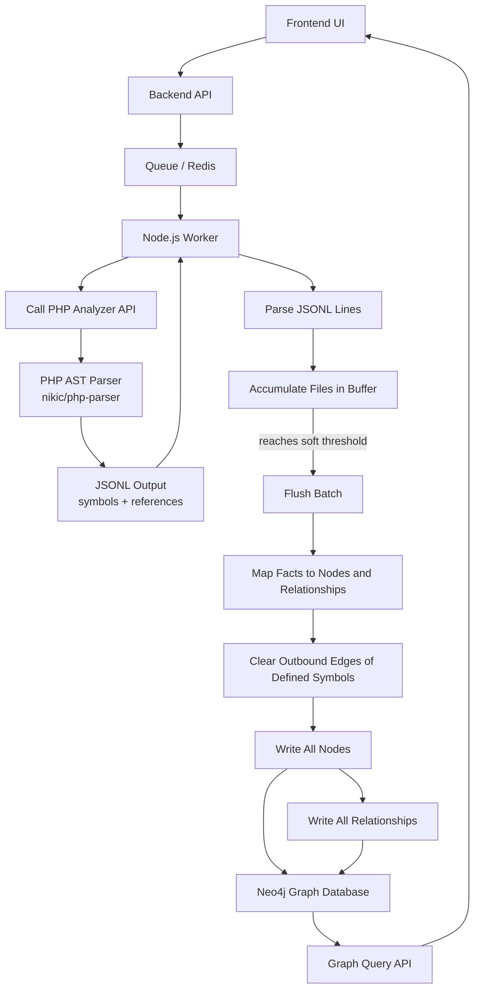
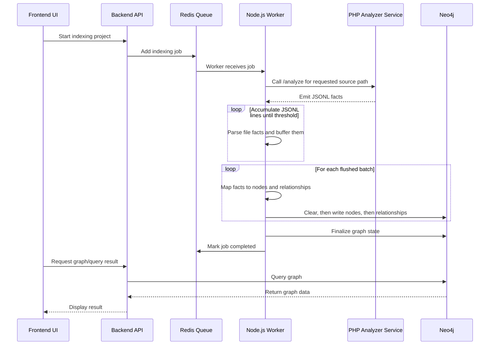
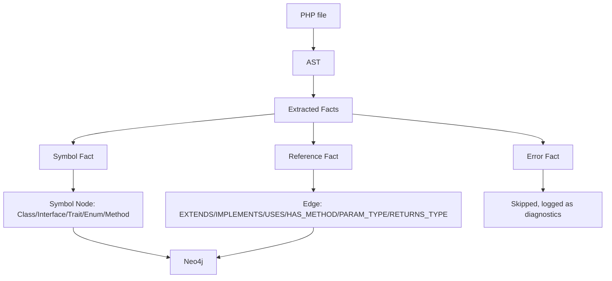
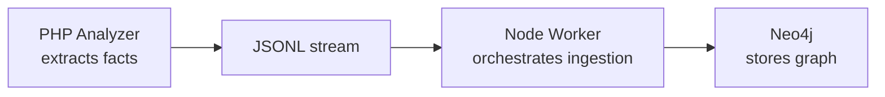

# World Mapping Architecture

Magentic uses source-code indexing to build a graph-backed world model for AI grounding. The PHP analyzer extracts facts from source files, and the Node.js worker turns those facts into graph nodes and relationships in Neo4j.

The PHP analyzer maps PHP class, interface, trait, and enum declarations, their inheritance and composition references (`extends`, `implements`, `uses`), and their methods. Each method carries its signature, and its parameter and return **types** are mapped as edges to the referenced type nodes — drawn from both the native signature and the docblock. Scalar/fundamental types stay as string fields rather than nodes. The method-call graph and member-level nodes (properties, constants, enum cases) are intentionally out of scope; see "Scope and Non-Goals" at the end of this document.

For a compact, machine-readable reference of every node kind, relationship type, edge property, and type-mapping rule, see `packages/mcp/resource/graph-schema.json` (the slim schema the MCP server serves to agents). A worked example graph in adjacency form is embedded in the "PHP Source Graph Mapping" section below.



## Responsibility Split

```mermaid
flowchart LR
    subgraph PHP_Analyzer_Service[PHP Analyzer Service]
        A1[Resolve requested paths]
        A2[Stream PHP files]
        A3[Parse AST]
        A4[Extract symbols]
        A5[Extract references]
        A6[Emit JSONL]
    end

    subgraph Node_Worker[Node.js Worker]
        B1[Start indexing job]
        B2[Call PHP analyzer]
        B3[Read JSONL stream]
        B4[Accumulate files until soft threshold]
        B5[Map facts to nodes and relationships]
        B6[Clear, write nodes, write relationships]
        B7[Update job status]
    end

    subgraph Neo4j[Neo4j]
        C1[Symbol nodes: Class, Interface, Trait, Enum, Method]
        C2[EXTENDS, IMPLEMENTS, USES relationships]
        C3[HAS_METHOD relationships]
        C4[PARAM_TYPE and RETURNS_TYPE relationships]
    end

    PHP_Analyzer_Service --> Node_Worker
    Node_Worker --> Neo4j
```



## Runtime Flow



## Fact Flow



## PHP Analyzer Service

The analyzer reads paths relative to `MAGENTIC_ANALYZED_SOURCE_PATH`. In Docker, the default container path is `/mnt/analyzed-source`.

```bash
docker run --rm --network magentic_default curlimages/curl -s -X POST http://magentic_analyzer_php/analyze -H "Content-Type: application/json" -d '{"path": "vendor/magento/module-catalog"}'
```

The endpoint returns JSONL. It does not write graph data directly and does not emit human-readable status lines on stdout.

## Example JSONL Output

Each line is one analyzed file with its `facts` array. The `symbolId` is the symbol's fully-qualified name verbatim (a method's id is `<owner FQN>::<name>`); the kind is never encoded in the id. The example below is a class that extends a parent, implements an interface, uses a trait, and declares one method whose parameter and return types map to type edges (one native, one docblock-only array element). A file that failed to parse follows.

```jsonl
{"file":"Vendor/Module/A.php","facts":[{"fact":"symbol","symbolId":"Vendor\\Module\\A","fqcn":"Vendor\\Module\\A","kind":"class","defined":true,"properties":{"abstract":false,"final":false,"readonly":false}},{"fact":"symbol","symbolId":"Vendor\\Module\\B","fqcn":"Vendor\\Module\\B","kind":"class","defined":false},{"fact":"reference","kind":"extends","fromSymbolId":"Vendor\\Module\\A","toSymbolId":"Vendor\\Module\\B"},{"fact":"symbol","symbolId":"Vendor\\Module\\C","fqcn":"Vendor\\Module\\C","kind":"interface","defined":false},{"fact":"reference","kind":"implements","fromSymbolId":"Vendor\\Module\\A","toSymbolId":"Vendor\\Module\\C"},{"fact":"symbol","symbolId":"Vendor\\Module\\T","fqcn":"Vendor\\Module\\T","kind":"trait","defined":false},{"fact":"reference","kind":"uses","fromSymbolId":"Vendor\\Module\\A","toSymbolId":"Vendor\\Module\\T"},{"fact":"symbol","symbolId":"Vendor\\Module\\D","fqcn":"Vendor\\Module\\D","kind":"","defined":false},{"fact":"reference","kind":"param_type","fromSymbolId":"Vendor\\Module\\A::handle","toSymbolId":"Vendor\\Module\\D","fields":{"name":"input","position":0,"source":"native"},"identityKey":"0"},{"fact":"symbol","symbolId":"Vendor\\Module\\E","fqcn":"Vendor\\Module\\E","kind":"","defined":false},{"fact":"reference","kind":"returns_type","fromSymbolId":"Vendor\\Module\\A::handle","toSymbolId":"Vendor\\Module\\E","fields":{"source":"docblock","is_array":true}},{"fact":"symbol","symbolId":"Vendor\\Module\\A::handle","fqcn":"Vendor\\Module\\A::handle","kind":"method","defined":true,"properties":{"name":"handle","visibility":"public","static":false,"abstract":false,"final":false,"hasBody":true,"returnType":"array","paramNames":["input"],"paramTypes":[""],"parameters":[{"optional":false,"variadic":false,"byRef":false,"promoted":false}]}},{"fact":"reference","kind":"has_method","fromSymbolId":"Vendor\\Module\\A","toSymbolId":"Vendor\\Module\\A::handle"}]}
{"file":"relative/path/bad.php","facts":[{"fact":"error","path":"relative/path/bad.php","message":"Syntax error, unexpected EOF on line 1"}]}
```

Current facts:

- `symbol`: declares or references a PHP symbol by its FQN `symbolId`. Mapped into Neo4j with a multi-label taxonomy — `:Symbol:PHP:Class`, `:Symbol:PHP:Interface`, `:Symbol:PHP:Trait`, `:Symbol:PHP:Enum`, `:Symbol:PHP:Method` — derived from the fact's `kind`. A referenced type whose kind is unknown (a parameter or return type whose declaration is outside the analyzed scope) is emitted with an empty `kind` and lands as a bare `:Symbol:PHP` anchor. Each symbol carries a `defined` flag: `true` when the file declares the symbol, `false` for referenced-only anchors (a parent, an implemented interface, a used trait, or a parameter/return type) emitted so a relationship has an endpoint. Declarations may carry a `properties` map (class modifiers; full method signature fields).
- `reference`: records a relationship between symbols. `kind` maps to the edge type by upper-casing it: `extends` → `EXTENDS`, `implements` → `IMPLEMENTS`, `uses` → `USES`, `has_method` → `HAS_METHOD`, `param_type` → `PARAM_TYPE`, `returns_type` → `RETURNS_TYPE`. Each relationship carries an `identity` hash (`sha256(fromSymbolId + ":" + TYPE + ":" + toSymbolId` plus an optional discriminator such as a parameter `position`) so re-indexing cannot create duplicate edges, while two parameters of the same type remain distinct. Reference facts may carry `fields` (edge properties such as a parameter's `name`/`position` and a type edge's `source` of `native`/`docblock` and `is_array`).
- `error`: records parser or read failures for one file while allowing the stream to continue. The worker skips error facts; they are not written to the graph.

Duplicate symbol facts are expected: a referenced symbol appears in every file that mentions it. The ingestion layer `MERGE`s nodes by id on the base `:Symbol` label and paints the kind labels via `SET`, so duplicates — including an anchor and its later real declaration — collapse onto one node.

## Ingestion Workflow (Node.js Worker)

The worker consumes the analyzer's JSONL stream and writes it into Neo4j in batches. The entry point is `packages/core/src/worker/index-source-worker.ts`, which hands the response stream to `consumeFactStream` in `packages/core/src/modules/processing/source-php/consume-fact-stream.ts`.

1. **Stream and parse.** Each stream line is one analyzed file. The line is parsed into a `FileFacts` object (`{ file, facts[] }`). Malformed lines are logged and skipped.
2. **Accumulate.** Parsed files are buffered while the total number of facts is counted. The buffer is not flushed per file.
3. **Soft-threshold flush.** When the accumulated fact count reaches `GRAPH_BATCH_SIZE` (default `5000`), the whole buffer is flushed. The threshold is soft: a file is never split, so the batch overshoots by the last file's facts (for example 4,999 + 50 facts triggers a flush at 5,049). The final partial buffer is always flushed when the stream ends. See `fact-accumulator.ts`.
4. **Map.** Across the flushed files, symbol facts become nodes and reference facts become relationships. Nodes are de-duplicated by `symbolId` and relationships by `identity`, so a widely referenced interface collapses to a single node and edge. The ids of symbols with `defined: true` are collected as the set whose outbound edges will be cleared. See `map-records.ts`.
5. **Write.** Each flush is written over one reused Neo4j session, in order: **clear** the outbound relationships of the defined symbols, then write **all nodes**, then write **all relationships**. Nodes are written before relationships because a relationship `MERGE` matches existing endpoint nodes, and every relationship's endpoints are part of the same flush. See `save-source.ts` and `packages/core/src/modules/graph/upsert.ts`.

Only the outbound edges of the symbols a file **defines** are cleared. Referenced-only symbols (`defined: false`) keep their own edges, which prevents one file from deleting another file's relationships during re-indexing.

`GRAPH_BATCH_SIZE` is the single knob for both batch and transaction size; a larger value means fewer, larger transactions. It is read in `packages/core/src/config.ts` and set on the worker in `docker-compose.yml`.

## Graph Schema

The constraints this workflow relies on are defined in `packages/core/schema/neo4j/*.cypher` and installed at startup; they are not created by this ingestion path. See `AGENTS.md` (Core Layout) for the schema installation flow.

- `Symbol.id` uniqueness — used by the clear step and every node/relationship `MERGE` lookup.
- Edge `identity` uniqueness for `EXTENDS` and `IMPLEMENTS` (`002`/`003`), `HAS_METHOD` and `USES` (`004`), `PARAM_TYPE` and `RETURNS_TYPE` (`005`), and `DECLARED_IN_PACKAGE` (`006`).

## PHP Source Graph Mapping

The graph model has two complementary references:

- `packages/mcp/resource/graph-schema.json` — the slim, machine-readable schema (node kinds, labels, properties, relationship types, edge properties, type-mapping rules). This is the source of truth the MCP server serves to agents via the `get_graph_schema` tool, kept terse for low token cost.
- The worked example below — a single adjacency structure where each node is keyed by its id and lists its outbound relationships (`out`), covering the main scenarios (inheritance, trait use, methods, native and docblock type edges, unions, array elements, scalar backfill, and referenced-only anchors).

Highlights of the model (the schema JSON and the worked example have the full detail):

- **Node id is the FQN.** A method id is `<owner FQN>::<name>`. Kind is never in the id; it lives in the label and the `kind` property. PHP guarantees one symbol per FQN, so the FQN alone is a stable, kind-agnostic key, which is what lets a parameter/return type reference a symbol without yet knowing whether it is a class, interface, or enum.
- **Type edges.** Class/interface/enum/trait parameter and return types become `PARAM_TYPE` / `RETURNS_TYPE` edges to the type node. Fundamental scalars (`int`, `string`, `array`, `void`, ...) stay as the `returnType` / `paramTypes` string fields and never become nodes, which avoids scalar supernodes.
- **Native vs docblock provenance.** Native signature types are edges with `source: "native"`. Docblock `@param`/`@return` class types are added with `source: "docblock"`, but only when the class is not already in the native set at that position — so identical native/doc types are not stored twice. Array/list/iterable element types from docblocks carry `is_array: true`. Untyped parameters and returns backfill a fundamental scalar from the docblock. Unresolvable, pseudo, or malformed docblock types are dropped entirely.
- **Parameter edges** carry `name` and `position`; the `position` is folded into the edge identity so two parameters of the same type remain distinct edges, and a union type fans out into one edge per class constituent.

### Worked Example

Each node below is keyed by its id and lists its outbound relationships (`out`); targets in `out[].to` reference other node ids in the same structure. Together these cover inheritance, trait use, methods, native and docblock type edges, a union type, a docblock array element, scalar backfill, an enum, and referenced-only anchors (`defined: false`).

```json
{
  "Magento\\Catalog\\Model\\ProductRepository": {
    "labels": ["Symbol", "PHP", "Class"],
    "defined": true,
    "properties": { "fqcn": "Magento\\Catalog\\Model\\ProductRepository", "kind": "class", "file": "Magento/Catalog/Model/ProductRepository.php", "abstract": false, "final": false, "readonly": false },
    "out": [
      { "type": "EXTENDS", "to": "Magento\\Catalog\\Model\\AbstractRepository" },
      { "type": "IMPLEMENTS", "to": "Magento\\Catalog\\Api\\ProductRepositoryInterface" },
      { "type": "USES", "to": "Magento\\Framework\\Cache\\CacheAwareTrait" },
      { "type": "HAS_METHOD", "to": "Magento\\Catalog\\Model\\ProductRepository::__construct" },
      { "type": "HAS_METHOD", "to": "Magento\\Catalog\\Model\\ProductRepository::save" },
      { "type": "HAS_METHOD", "to": "Magento\\Catalog\\Model\\ProductRepository::getById" },
      { "type": "DECLARED_IN_PACKAGE", "to": "package:magento/module-catalog" }
    ]
  },
  "package:magento/module-catalog": {
    "labels": ["Package"],
    "comment": "A composer-lock graph node, linked in by the index-links pipeline via PSR-4 (Magento\\Catalog\\ prefixes the class FQN). Properties abbreviated here; see the composer-lock graph for the full Package shape.",
    "properties": { "id": "package:magento/module-catalog", "name": "magento/module-catalog", "type": "magento2-module", "psr4Namespaces": ["Magento\\Catalog\\"] },
    "out": []
  },
  "Magento\\Catalog\\Model\\ProductRepository::__construct": {
    "labels": ["Symbol", "PHP", "Method"],
    "defined": true,
    "comment": "Constructor-promoted dependency: the DI graph is captured here as a PARAM_TYPE edge (no separate property node).",
    "properties": { "fqcn": "Magento\\Catalog\\Model\\ProductRepository::__construct", "kind": "method", "file": "Magento/Catalog/Model/ProductRepository.php", "name": "__construct", "visibility": "public", "static": false, "abstract": false, "final": false, "hasBody": true, "returnType": "", "paramNames": ["resource"], "paramTypes": [""], "parametersJson": "[{\"optional\":false,\"variadic\":false,\"byRef\":false,\"promoted\":true}]" },
    "out": [
      { "type": "PARAM_TYPE", "to": "Magento\\Catalog\\Model\\ResourceModel\\Product", "properties": { "name": "resource", "position": 0, "source": "native" } }
    ]
  },
  "Magento\\Catalog\\Model\\ProductRepository::save": {
    "labels": ["Symbol", "PHP", "Method"],
    "defined": true,
    "comment": "Native object param + scalar param (scalar stays a field, no edge) + docblock-only array-element param + native and docblock return.",
    "properties": { "fqcn": "Magento\\Catalog\\Model\\ProductRepository::save", "kind": "method", "file": "Magento/Catalog/Model/ProductRepository.php", "name": "save", "visibility": "public", "static": false, "abstract": false, "final": false, "hasBody": true, "returnType": "", "paramNames": ["product", "storeId", "items"], "paramTypes": ["", "int", "array"], "parametersJson": "[{\"optional\":false,\"variadic\":false,\"byRef\":false,\"promoted\":false},{\"optional\":true,\"variadic\":false,\"byRef\":false,\"promoted\":false},{\"optional\":true,\"variadic\":false,\"byRef\":false,\"promoted\":false}]" },
    "out": [
      { "type": "PARAM_TYPE", "to": "Magento\\Catalog\\Api\\Data\\ProductInterface", "properties": { "name": "product", "position": 0, "source": "native" } },
      { "type": "PARAM_TYPE", "to": "Magento\\Catalog\\Api\\Data\\ProductTierPriceInterface", "properties": { "name": "items", "position": 2, "source": "docblock", "is_array": true } },
      { "type": "RETURNS_TYPE", "to": "Magento\\Catalog\\Api\\Data\\ProductInterface", "properties": { "source": "native" } }
    ]
  },
  "Magento\\Catalog\\Model\\ProductRepository::getById": {
    "labels": ["Symbol", "PHP", "Method"],
    "defined": true,
    "comment": "Untyped param `id` backfills its scalar from the docblock; return type is documented only (no native return) so it is a docblock RETURNS_TYPE edge.",
    "properties": { "fqcn": "Magento\\Catalog\\Model\\ProductRepository::getById", "kind": "method", "file": "Magento/Catalog/Model/ProductRepository.php", "name": "getById", "visibility": "public", "static": false, "abstract": false, "final": false, "hasBody": true, "returnType": "", "paramNames": ["id"], "paramTypes": ["int"], "parametersJson": "[{\"optional\":false,\"variadic\":false,\"byRef\":false,\"promoted\":false}]" },
    "out": [
      { "type": "RETURNS_TYPE", "to": "Magento\\Catalog\\Api\\Data\\ProductInterface", "properties": { "source": "docblock", "is_array": false } }
    ]
  },
  "Magento\\Catalog\\Api\\ProductRepositoryInterface": {
    "labels": ["Symbol", "PHP", "Interface"],
    "defined": true,
    "properties": { "fqcn": "Magento\\Catalog\\Api\\ProductRepositoryInterface", "kind": "interface", "file": "Magento/Catalog/Api/ProductRepositoryInterface.php" },
    "out": [
      { "type": "EXTENDS", "to": "Magento\\Framework\\Api\\RepositoryInterface" },
      { "type": "HAS_METHOD", "to": "Magento\\Catalog\\Api\\ProductRepositoryInterface::save" }
    ]
  },
  "Magento\\Catalog\\Api\\ProductRepositoryInterface::save": {
    "labels": ["Symbol", "PHP", "Method"],
    "defined": true,
    "comment": "Interface method: abstract with no body. Implementations are resolvable at query time via IMPLEMENTS/EXTENDS/USES + HAS_METHOD name match (no override edge stored).",
    "properties": { "fqcn": "Magento\\Catalog\\Api\\ProductRepositoryInterface::save", "kind": "method", "file": "Magento/Catalog/Api/ProductRepositoryInterface.php", "name": "save", "visibility": "public", "static": false, "abstract": false, "final": false, "hasBody": false, "returnType": "", "paramNames": ["product"], "paramTypes": [""], "parametersJson": "[{\"optional\":false,\"variadic\":false,\"byRef\":false,\"promoted\":false}]" },
    "out": [
      { "type": "PARAM_TYPE", "to": "Magento\\Catalog\\Api\\Data\\ProductInterface", "properties": { "name": "product", "position": 0, "source": "native" } },
      { "type": "RETURNS_TYPE", "to": "Magento\\Catalog\\Api\\Data\\ProductInterface", "properties": { "source": "native" } }
    ]
  },
  "Magento\\Framework\\Cache\\CacheAwareTrait": {
    "labels": ["Symbol", "PHP", "Trait"],
    "defined": true,
    "properties": { "fqcn": "Magento\\Framework\\Cache\\CacheAwareTrait", "kind": "trait", "file": "Magento/Framework/Cache/CacheAwareTrait.php" },
    "out": [
      { "type": "HAS_METHOD", "to": "Magento\\Framework\\Cache\\CacheAwareTrait::flushCache" }
    ]
  },
  "Magento\\Framework\\Cache\\CacheAwareTrait::flushCache": {
    "labels": ["Symbol", "PHP", "Method"],
    "defined": true,
    "properties": { "fqcn": "Magento\\Framework\\Cache\\CacheAwareTrait::flushCache", "kind": "method", "file": "Magento/Framework/Cache/CacheAwareTrait.php", "name": "flushCache", "visibility": "protected", "static": false, "abstract": false, "final": false, "hasBody": true, "returnType": "void", "paramNames": [], "paramTypes": [], "parametersJson": "[]" },
    "out": []
  },
  "Magento\\Catalog\\Model\\Product\\Visibility": {
    "labels": ["Symbol", "PHP", "Enum"],
    "defined": true,
    "comment": "Enum: implements an interface and may use a trait, exactly like a class. Enum cases are not modeled as nodes.",
    "properties": { "fqcn": "Magento\\Catalog\\Model\\Product\\Visibility", "kind": "enum", "file": "Magento/Catalog/Model/Product/Visibility.php" },
    "out": [
      { "type": "IMPLEMENTS", "to": "Magento\\Framework\\Data\\OptionSourceInterface" },
      { "type": "HAS_METHOD", "to": "Magento\\Catalog\\Model\\Product\\Visibility::label" }
    ]
  },
  "Magento\\Catalog\\Model\\Product\\Visibility::label": {
    "labels": ["Symbol", "PHP", "Method"],
    "defined": true,
    "properties": { "fqcn": "Magento\\Catalog\\Model\\Product\\Visibility::label", "kind": "method", "file": "Magento/Catalog/Model/Product/Visibility.php", "name": "label", "visibility": "public", "static": false, "abstract": false, "final": false, "hasBody": true, "returnType": "string", "paramNames": [], "paramTypes": [], "parametersJson": "[]" },
    "out": []
  },
  "Magento\\Framework\\Mview\\View::__construct": {
    "labels": ["Symbol", "PHP", "Method"],
    "defined": true,
    "comment": "Union-typed parameter: `ConfigInterface|ConfigReader $config` fans out into two PARAM_TYPE edges that share name and position but target different nodes (distinct identities). A second param of the SAME type as another would also be its own edge, distinguished by position.",
    "properties": { "fqcn": "Magento\\Framework\\Mview\\View::__construct", "kind": "method", "file": "Magento/Framework/Mview/View.php", "name": "__construct", "visibility": "public", "static": false, "abstract": false, "final": false, "hasBody": true, "returnType": "", "paramNames": ["config"], "paramTypes": [""], "parametersJson": "[{\"optional\":false,\"variadic\":false,\"byRef\":false,\"promoted\":false}]" },
    "out": [
      { "type": "PARAM_TYPE", "to": "Magento\\Framework\\Mview\\ConfigInterface", "properties": { "name": "config", "position": 0, "source": "native" } },
      { "type": "PARAM_TYPE", "to": "Magento\\Framework\\Mview\\Config\\Reader", "properties": { "name": "config", "position": 0, "source": "native" } }
    ]
  },
  "Magento\\Catalog\\Model\\AbstractRepository": {
    "labels": ["Symbol", "PHP", "Class"],
    "defined": false,
    "comment": "Referenced-only parent declared elsewhere in scope: emitted as a defined:false anchor so EXTENDS has an endpoint; gains its full properties when its own file is indexed.",
    "properties": { "fqcn": "Magento\\Catalog\\Model\\AbstractRepository" },
    "out": []
  },
  "Magento\\Catalog\\Api\\Data\\ProductTierPriceInterface": {
    "labels": ["Symbol", "PHP"],
    "defined": false,
    "comment": "Kind-unknown anchor: this type is only ever referenced (here as a docblock array element). Its declaring file was not in the analyzed scope, so the kind is unknown and the bare :Symbol:PHP label is used until (if ever) it is declared.",
    "properties": { "fqcn": "Magento\\Catalog\\Api\\Data\\ProductTierPriceInterface" },
    "out": []
  }
}
```

## Package Linking

The PHP source graph and the composer-lock graph (`Package`/`Author` nodes) are produced by two independent pipelines. A third pipeline connects them with `DECLARED_IN_PACKAGE` edges (declared `:Symbol` → `:Package`).

- **Bridge:** PSR-4. Composer indexing writes a queryable `psr4Namespaces` string list on each `Package` node; a declared symbol's package is the one whose namespace is the **longest matching prefix** of the symbol's FQN.
- **Cypher-driven:** the match runs entirely in Neo4j (`UNWIND` namespaces, index-backed `STARTS WITH` against `:Symbol` nodes filtered to declared types — `kind IN [class, interface, trait, enum]` with a `file`), so no symbol data is loaded into the worker. Edges are written with `MERGE` inside `CALL { } IN TRANSACTIONS` to keep transactions bounded. See `src/modules/processing/package-linking/link-symbols-to-packages.ts`.
- **Pipeline:** the `index-links` queue/worker, triggered by `POST /api/graph/index/links`. The body is optional: `{ "symbolId": "<FQN>" }` re-links a single symbol (for incremental/file-watcher updates); an empty body clears and rebuilds all links.
- **Scope:** only declared classes, interfaces, traits, and enums are linked (methods inherit their owner's package via `HAS_METHOD`). Symbols autoloaded by `classmap`/`psr-0` rather than PSR-4 (e.g. `Magento\Setup\*`, legacy `Zend_*`, test classes) are intentionally not linked. A namespace declared by two packages yields one edge to each.

This is the change that lets the two world-models be queried together, e.g. "which package owns this class" or "this class extends a class owned by another package — does its composer manifest require that package?".

## Indexing Pipelines and Orchestration

The graph is produced by three pipelines, each a BullMQ queue and worker:

- **Composer** (`index-packages`): parses `composer.lock` into `Package`/`Author` nodes and composer relationships. It uses **merge-and-prune** writes (`src/modules/graph/merge-sync.ts`): MERGE the current nodes and edges, then delete the packages, authors, and edges no longer present in the lock. Existing nodes — and their inbound `DECLARED_IN_PACKAGE` edges — survive a re-run, while removed dependencies are pruned.
- **Source** (`index-source`): the ingestion workflow above. It also handles **targeted deletion** — `DELETE` by path removes the declared symbols whose `file` is the path or under it (a batched `DETACH DELETE`).
- **Linking** (`index-links`): the Package Linking step above.

These are driven by the Graph Indexing API (endpoint reference in `docs/architecture_project.md`). A full **reindex** runs the pipelines in order `packages → source → links`; **reset-and-reindex** prepends a whole-graph delete (`delete-graph → packages → source → links`). Ordering is expressed with a BullMQ `FlowProducer` — `links` is always last because it depends on both source and packages. A full operation runs **exclusively** (a Redis lock returns `409` to a second full request), and the incremental **delta** endpoint — the file-watcher entry point that routes each changed path to the right pipeline — is paused while a full operation is running.

## Scope and Non-Goals

- **The method-call graph (method calls method) is permanently out of scope.** It would require full method-body traversal and receiver-type resolution, and Magento's DI/factory/magic (`$factory->create()` hiding the produced type) makes it materially incomplete. Signature and docblock types are the deliberate substitute.
- **Member-level nodes — properties, class constants, and enum cases — are not modeled.** Constructor dependency information is already captured by the constructor's `PARAM_TYPE` edges, so property nodes add little; enum cases and most constants are low-value-per-volume for graph querying.
- **Override edges (`IMPLEMENTS_METHOD`) are not stored.** Implementations of an interface method are resolvable at query time from `IMPLEMENTS` / `EXTENDS` / `USES` + `HAS_METHOD` matched by method name.

## Main Principle



The PHP Analyzer should stay simple: it reads source code and emits facts.

The Node.js worker owns the workflow: job execution, status, JSONL parsing, TypeScript mapping, and Neo4j writes.

Neo4j stores the final graph: nodes and relationships.
