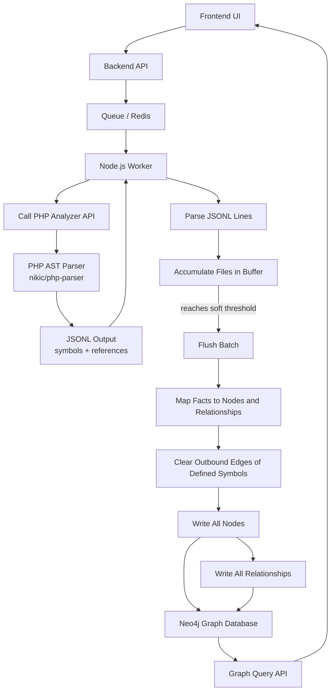
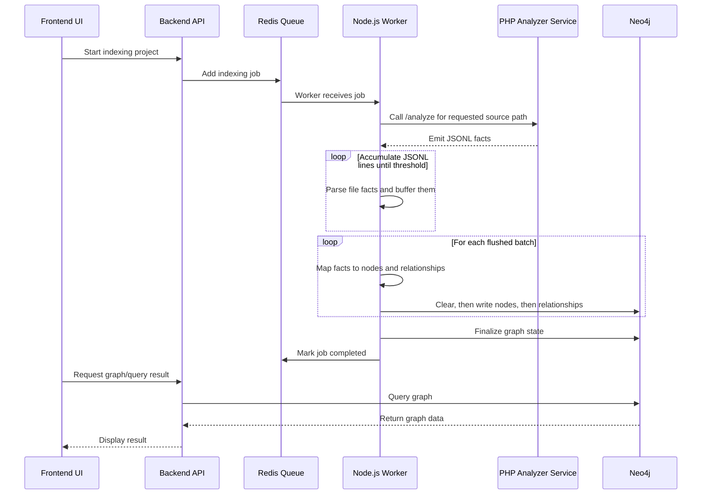
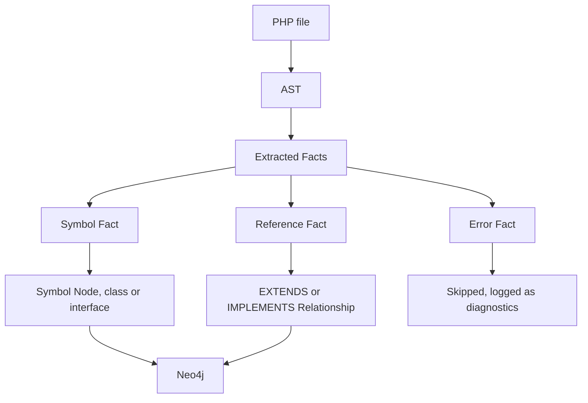
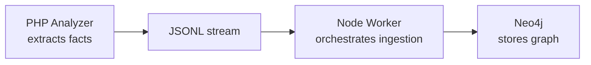

# World Mapping Architecture

Magentic uses source-code indexing to build a graph-backed world model for AI grounding. The PHP analyzer extracts facts from source files, and the Node.js worker turns those facts into graph nodes and relationships in Neo4j.

The PHP analyzer maps PHP class and interface declarations together with their inheritance references: class `extends`, class `implements`, and interface `extends`. Later phases can add traits, method calls, dependency injection relationships, package ownership, XML configuration, and other Magento-specific facts.



## Responsibility Split

```mermaid
flowchart LR
    subgraph PHP_Analyzer_Service[PHP Analyzer Service]
        A1[Resolve requested paths]
        A2[Stream PHP files]
        A3[Parse AST]
        A4[Extract symbols]
        A5[Extract references]
        A6[Emit JSONL]
    end

    subgraph Node_Worker[Node.js Worker]
        B1[Start indexing job]
        B2[Call PHP analyzer]
        B3[Read JSONL stream]
        B4[Accumulate files until soft threshold]
        B5[Map facts to nodes and relationships]
        B6[Clear, write nodes, write relationships]
        B7[Update job status]
    end

    subgraph Neo4j[Neo4j]
        C1[Symbol class and interface nodes]
        C2[Package nodes]
        C3[EXTENDS and IMPLEMENTS relationships]
        C4[BELONGS_TO_PACKAGE relationships]
    end

    PHP_Analyzer_Service --> Node_Worker
    Node_Worker --> Neo4j
```



## Runtime Flow



## Fact Flow



## PHP Analyzer Service

The analyzer reads paths relative to `MAGENTIC_ANALYZED_SOURCE_PATH`. In Docker, the default container path is `/mnt/analyzed-source`.

```bash
docker run --rm --network magentic_default curlimages/curl -s -X POST http://magentic_analyzer_php/analyze -H "Content-Type: application/json" -d '{"path": "vendor/magento/module-catalog"}'
```

The endpoint returns JSONL. It does not write graph data directly and does not emit human-readable status lines on stdout.

## Example JSONL Output

Each line is one analyzed file with its `facts` array. The example below is a class that both extends a parent class and implements an interface, followed by a file that failed to parse.

```jsonl
{"file":"Vendor/Module/A.php","facts":[{"fact":"symbol","symbolId":"php-class:Vendor\\Module\\A","fqcn":"Vendor\\Module\\A","kind":"class","defined":true},{"fact":"symbol","symbolId":"php-class:Vendor\\Module\\B","fqcn":"Vendor\\Module\\B","kind":"class","defined":false},{"fact":"symbol","symbolId":"php-interface:Vendor\\Module\\C","fqcn":"Vendor\\Module\\C","kind":"interface","defined":false},{"fact":"reference","kind":"extends","fromSymbolId":"php-class:Vendor\\Module\\A","toSymbolId":"php-class:Vendor\\Module\\B"},{"fact":"reference","kind":"implements","fromSymbolId":"php-class:Vendor\\Module\\A","toSymbolId":"php-interface:Vendor\\Module\\C"}]}
{"file":"relative/path/bad.php","facts":[{"fact":"error","path":"relative/path/bad.php","message":"Syntax error, unexpected EOF on line 1"}]}
```

Current facts:

- `symbol`: declares or references a PHP class or interface symbol by stable `symbolId`. Mapped into Neo4j using a multi-label taxonomy (`:Symbol:PHP:Class`, `:Symbol:PHP:Interface`). Each symbol carries a `defined` flag: `true` when the file declares the symbol, `false` when it only references it (a parent class or implemented interface emitted so the relationship has an endpoint).
- `reference`: records a relationship between symbols. `kind: "extends"` (class extends class, or interface extends interface) becomes an `EXTENDS` relation; `kind: "implements"` (class implements interface) becomes an `IMPLEMENTS` relation. Each relationship carries an `identity` hash (`sha256(fromSymbolId + ":" + TYPE + ":" + toSymbolId)`) so re-indexing cannot create duplicate edges.
- `error`: records parser or read failures for one file while allowing the stream to continue. The worker skips error facts; they are not written to the graph.

Duplicate symbol facts are expected: a referenced symbol appears in every file that mentions it. The ingestion layer `MERGE`s nodes by `symbolId`, so duplicates collapse to one node.

## Ingestion Workflow (Node.js Worker)

The worker consumes the analyzer's JSONL stream and writes it into Neo4j in batches. The entry point is `packages/core/src/worker/index-source-worker.ts`, which hands the response stream to `consumeFactStream` in `packages/core/src/modules/processing/php-analysis/consume-fact-stream.ts`.

1. **Stream and parse.** Each stream line is one analyzed file. The line is parsed into a `FileFacts` object (`{ file, facts[] }`). Malformed lines are logged and skipped.
2. **Accumulate.** Parsed files are buffered while the total number of facts is counted. The buffer is not flushed per file.
3. **Soft-threshold flush.** When the accumulated fact count reaches `GRAPH_BATCH_SIZE` (default `5000`), the whole buffer is flushed. The threshold is soft: a file is never split, so the batch overshoots by the last file's facts (for example 4,999 + 50 facts triggers a flush at 5,049). The final partial buffer is always flushed when the stream ends. See `fact-accumulator.ts`.
4. **Map.** Across the flushed files, symbol facts become nodes and reference facts become relationships. Nodes are de-duplicated by `symbolId` and relationships by `identity`, so a widely referenced interface collapses to a single node and edge. The ids of symbols with `defined: true` are collected as the set whose outbound edges will be cleared. See `map-records.ts`.
5. **Write.** Each flush is written over one reused Neo4j session, in order: **clear** the outbound relationships of the defined symbols, then write **all nodes**, then write **all relationships**. Nodes are written before relationships because a relationship `MERGE` matches existing endpoint nodes, and every relationship's endpoints are part of the same flush. See `save-facts.ts` and `packages/core/src/modules/graph/upsert.ts`.

Only the outbound edges of the symbols a file **defines** are cleared. Referenced-only symbols (`defined: false`) keep their own edges, which prevents one file from deleting another file's relationships during re-indexing.

`GRAPH_BATCH_SIZE` is the single knob for both batch and transaction size; a larger value means fewer, larger transactions. It is read in `packages/core/src/config.ts` and set on the worker in `docker-compose.yml`.

## Graph Schema

The constraints and indexes this workflow relies on — `Symbol.id` uniqueness (used by the clear and `MERGE` lookups) and the `EXTENDS` / `IMPLEMENTS` edge identity constraints — are defined in `packages/core/schema/neo4j/*.cypher` and installed at startup. They are not created by this ingestion path. See `AGENTS.md` (Core Layout) for the schema installation flow.

## Main Principle



The PHP Analyzer should stay simple: it reads source code and emits facts.

The Node.js worker owns the workflow: job execution, status, JSONL parsing, TypeScript mapping, and Neo4j writes.

Neo4j stores the final graph: nodes and relationships.
