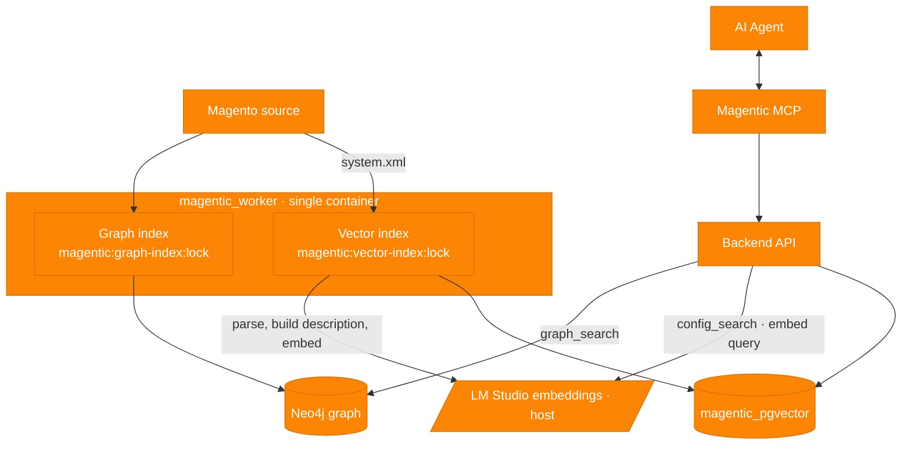

# Plan: Vector Config Search (semantic search over `system.xml`)

> Status: **planned, not started.** A second, independent indexing pipeline that
> embeds Magento admin-config descriptions into a vector database so an AI agent
> can find configuration by plain-English meaning ("where do I set the payment
> gateway?") rather than exact keywords. It is fully decoupled from the graph —
> no shared nodes or edges; the config path string is the only id.

## Goal

Magento's `system.xml` describes admin configuration fields with human-readable
labels and help text. The symbolic graph can't answer "where do I configure X?"
because that is natural-language retrieval, not a structural relationship. This
pipeline turns each config field into a short **description** sentence, embeds it
with an external model, and stores the vector so the agent can search by meaning.

## Locked decisions

- **Vector store:** PostgreSQL + `pgvector`, in its **own container** —
  `magentic_pgvector` (image `pgvector/pgvector:pg17`, database `magentic_vectors`).
  Separate from `magentic_postgres`; nothing in the existing app DB changes.
- **Embedding model:** an **external local model in LM Studio** (OpenAI-compatible
  `POST /v1/embeddings`). No model service in this project. No model-swap design.
- **Two fully independent index pipelines**, no coupling between graph and vector:
  - graph pipeline (existing) — lock `magentic:graph-index:lock`
    (rename of the current `magentic:full-index:lock`).
  - vector pipeline (new) — lock `magentic:vector-index:lock`.
  - Independent status, independent reindex/reset controls. No join step, no
    super-parent, no shared ids beyond the config `path` string.
- **One worker container.** The vector worker runs inside the existing
  `magentic_worker` process (the work is I/O-bound — DB writes + HTTP to LM Studio —
  so it runs concurrently with the graph workers on the single event loop).
- **No re-embed cache in v1.** A full vector reindex re-embeds everything; that is
  acceptable at `system.xml` scale and bounded later by selective reindex.
- **File-watcher-driven incremental re-embedding is deferred** — not defined yet.

## Business logic lives in core

All Node logic stays in the `core` package, reusing existing patterns:

- `system.xml` parser + description builder — alongside the `magento-xml` handlers.
- Vector index orchestration (queue + worker + lock + status).
- The `/api/vector/*` routes and search.

New infrastructure only: the `magentic_pgvector` service. The embedding model is
external (LM Studio). A future swap to a dedicated vector DB (e.g. Qdrant) is a new
service + a new `VectorStore` adapter; core logic is untouched.

## Ports (swap seams, both in core)

```ts
type Embedder = {
  embed(texts: string[]): Promise<number[][]>;   // v1 adapter: HTTP -> LM Studio
};

type VectorStore = {
  upsert(items: { path: string; description: string; embedding: number[] }[]): Promise<void>;
  search(embedding: number[], k: number): Promise<{ path: string; description: string; score: number }[]>;
  reset(): Promise<void>;
};
```

Core depends only on these interfaces. v1 ships one `Embedder` (LM Studio) and one
`VectorStore` (pgvector).

## The embedding dimension `N`

`pgvector` columns are typed `vector(N)` with a **fixed dimension `N`**, and the
query and stored vectors must come from the **same model**. `N` is the output
dimension of the chosen LM Studio embedding model (e.g. 384 / 768 / 1024 depending
on the model). Therefore:

- **Pin the model and `N` before Step 1** — `N` is baked into the table definition.
- Store the model name alongside the data so a later mismatch is detectable.
- Changing the model later = a full re-embed + table/index rebuild (out of scope
  for v1).

## Vector DB schema (`magentic_pgvector` → `magentic_vectors`)

```sql
CREATE EXTENSION IF NOT EXISTS vector;

CREATE TABLE config_embeddings (
  path        text PRIMARY KEY,            -- e.g. "payment/xy/api_gateway" (the id)
  description text NOT NULL,               -- the built natural-language sentence
  embedding   vector(N) NOT NULL,          -- N = the LM Studio model dimension
  model       text NOT NULL,               -- the embedding model used
  source_file text NOT NULL,
  updated_at  timestamptz NOT NULL DEFAULT now()
);
```

v1 uses exact nearest-neighbour search (no ANN index) — fine at this scale. An
HNSW index can be added later if the corpus or query rate grows.

## The description builder

Parse `section → group → field` from `system.xml` (labels, comment/help text, and
`backend_model`/`source_model`/`frontend_model` as plain strings), then compose a
deterministic **description** keyed by the config `path`:

> "This is module vendor XY. The API Gateway is in the Payment Methods group,
> XY payment method menu item, and inside the Settings section. Set API gateway
> here, only for production."

(`system.xml` labels are often i18n keys; v1 embeds the literal text and does not
resolve translations.)

## Index pipeline (new, independent)

- New `index-embeddings` queue + worker inside the existing `magentic_worker`.
- Trigger `POST /api/vector/index` (full reindex) and a reset that truncates
  `config_embeddings`.
- Holds `magentic:vector-index:lock` while running; never checks the graph lock.
- Added to the index status list so it surfaces in `/api/status` independently.
- Flow per run: discover `system.xml` → parse → build descriptions → `Embedder.embed`
  (LM Studio) → `VectorStore.upsert` (pgvector).

## Search path + MCP

- `POST /api/vector/search { query, k }` — embed the query via the `Embedder`,
  run `VectorStore.search`, return top-K `{ path, description, score }`.
- New MCP tool `config_search` wired to that route, alongside `graph_search`.
- Token-light by design: returns paths + short descriptions, not large payloads.

## UI

A second indexing section (separate from the graph one): its own **reindex** and
**reset** buttons and its own in-progress/locked status, reflecting the two
independent pipelines.

## Implementation steps

1. **Stand up `magentic_pgvector`.** Add the service (pgvector image), volume, and
   connection. Create `config_embeddings` with `vector(N)` for the pinned model.
2. **Prove the round-trip with LM Studio** (spike, before any Magento logic): wire
   the `Embedder` to LM Studio, insert hand-written test descriptions, embed, store,
   then search and confirm semantic matches (e.g. "fruit" surfaces an "apple"
   description). Validates the embedder contract, `N`, the schema, and the query.
3. **`system.xml` parser + description builder** in core.
4. **Indexer + MCP + UI:** the `index-embeddings` queue/worker/lock/status, the
   `/api/vector/*` routes, the `config_search` MCP tool, and the UI section.

## High-level workflow (single-worker version)



## Red flags / things to watch

- **Semantic quality is the model's job, not pgvector's**, and is probabilistic.
  Validate paraphrase/hypernym matching with the real LM Studio model in Step 2
  before promising it in the UX.
- **Pin model + `N`.** It is baked into the column type; a change forces a rebuild.
- **LM Studio host networking.** The worker container reaches LM Studio on the host
  via `host.docker.internal` (or host networking on Linux). Make the base URL an
  env var; do not hardcode.
- **No cache + full reindex** re-embeds everything; acceptable at this scale, but a
  full vector reindex is the slow path until selective reindex lands.
- **Shared Postgres tech, separate instance.** `magentic_pgvector` is its own
  container, so it does not load the app DB; the `VectorStore` port keeps a later
  move to a dedicated vector DB cheap.
- **LM Studio silently truncates oversized input** (no error; content past the
  model's 2048-token context window is dropped). Mitigated by an **in-house token
  estimator + length guard** — no external tokenizer library (tiktoken is
  OpenAI-only; Transformers.js drags in onnxruntime and downloads tokenizer files).
  The estimator is a cheap heuristic: `estimatedTokens = max(ceil(chars / 4),
  ceil(words / 0.75))` (take the larger, conservative figure). The indexer guards
  against a safe bound well under 2048 (e.g. ~1800 tokens) and logs/flags or
  explicitly truncates anything over it. Descriptions are ~15 tokens, so this never
  trips in practice — it is insurance against a future change silently losing text.
  If exact counts are ever needed, the upgrade path is a server that errors on
  overflow (HF TEI / vLLM via the `Embedder` port), not a client-side tokenizer.

## Out of scope (v1)

- Any graph↔vector link (no `:ConfigField` graph nodes, no shared ids beyond `path`).
- Model swapping / multi-model support.
- File-watcher-driven incremental re-embedding.
- ANN index tuning (exact search is fine for now).
- i18n label resolution.
